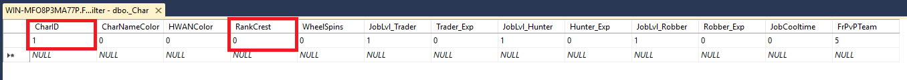

# Charicon Kullanım rehberi

Charicon oyun içerisindeki karakterlere, karakter isminin yanına o karaktere özel verebileceğiniz iconun sistemidir.

### Veritabanı ayarı;


````csharp
CharID: Kullanıcının karakterinin veritabanındaki sanal kimliği.

RankCrest: Kullanıcıya vereceğiniz iconın IDsi.
````

**NOT:** <span style="color:red">Bir karakter aynı anda en fazla 1 charicon'a sahip olabilir.</span>