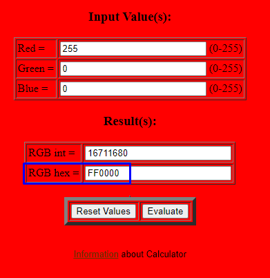

# Global Chatting Color Rehberi

GlobalChattingColor sistemi ile oyununuzda birden farklı renkte global chatting scrollar ekleyebilirsiniz.Sizler için kolay bir rehber olması açısından [HwanColor](hwancolor.md) ve [CharNameColor](charnamecolor.md) rehberlerinde [kullanmış olduğumuz site](https://www.shodor.org/stella2java/rgbint.html) üzerinden örneklendireceğim. GlobalChatting color sistemi ARGB(A = Şeffaflık) ile çalıştığından yukarıdaki rehberlerden biraz farklıdır.

### Örnek kullanım;
Yukarıda verilen adresteki siteye girip dilediğiniz RGB kodundan rengimizi seçiyoruz, daha sonrasında ise çıkan hex kodunu alıyoruz.

Daha sonrasında aldığımız bu hex kodunu kullanmak için bilgisayarımızdaki hesap makinesini çalıştırıp "Programlayıcı" modunu açıyoruz.

Programlayıcı modunu açtıktan (default olarak decimal kodda başlar.) hex moduna geçiyoruz.

Yukarıdaki almış olduğumuz hex kodunun başına (FF) ekliyoruz ve sonrasında "Decimal" mod'a tekrar dönüyoruz. (FF = hiç şeffaflık olmaması demek şeffaflaştırmak isterseniz hex kodunu kendi isteğinize göre değiştirebilirsiniz.)

Çıkarttığımız bu decimal moddaki sonuç ARGB olan bu rengin int değeridir. Daha sonrasında ise önceden klonlamış olduğumuz ve renklendirmek istediğimiz Global Chatting eşyamızın Shard veritabanımızdaki "_RefObjCommon" ID'sini F8Filter veritabanımızdaki "_RefGlobalChattingColor" tablosundaki RefItemID kolonuna ekliyoruz.

Son olarak QWORD olarak listelenmiş bu decimal sonucumuzu DWORD'e çevireceğiz. Bunun için yine hesap makinemizdeki QWORD butonuna tıklıyor ve çıkan sonucumuzu DWORD'e çeviriyoruz.

Gördüğünüz gibi QWORD butonuna tıkladığımızda sonucumuz DWORD'e dönüştü.

Shard veritabanımızdaki _RefObjCommon ID'mizi ekledikten sonra ARGB kolonuna yukarıda almış olduğumuz decimal sonucu ekliyoruz ve işlemimizi tamamlamış oluyoruz.

**NOT: İşlem sonrasında Filter sunucunuza işlemlerin aktifleşmesi için restart atmanız gerekmektedir.**