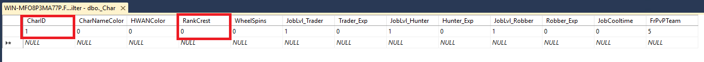

# Charicon Kullanım rehberi

Charicon oyun içerisindeki karakterlere, karakter isminin yanında o karaktere özel verebileceğiniz icon sistemidir.

### İstemci(Client) tarafı;

**RefRankCrest.txt dosyası media.pk2 dosyanızda "server_dep/silkroad/textdata/refrackcrest.txt" yolunda bulunmaktadır.**

>Kırmızı ile belirtilen alan, "Service" kolonudur. Bu alandan eklediğimiz icon'u aktif veya deaktif edebiliriz.
>
>Yeşil ile belirtilen alan, "Dosya yolu" kolonudur. Bu alandan media.pk2 dosyanıza eklemiş olduğunuz dosyanın(iconun) yolunu gösterebilirsiniz.
>
>Mavi ile belirtilen alan, "ID" kolonudur. Bu alandan iconunuza bir ID tanımlayabilirsiniz. Tanımladığınız bu ID'yi veritabanı tarafında kullanacaksınız.

### Veritabanı tarafı;

> CharID: Kullanıcının karakterinin veritabanındaki sanal kimliği.
> 
> RankCrest: Kullanıcıya vereceğiniz iconun ID'si. 

**Örnek bir SQL kodu ile "F8FilterTEST" isimli kullanıcı'ya RankCrest textimizdeki 1 numaralı icon'u verelim;**

~~~~Mssql
[USE F8Filter]
update _Char set RankCrest = '1' where CharID = (select CharID from SRO_VT_SHARD.._Char(NOLOCK) where charname16 = 'F8FilterTEST') --Eğer shard veritabanı adınız SRO_VT_SHARD değilse query'i kendi shard veritabanı adınız ile çalıştırmalısınız.
~~~~

**NOT:** Bir karakter aynı anda en fazla 1 charicon'a sahip olabilir.

**NOT2:** Ekleyeceğiniz iconlar 16x16 boyutuna sahip olmalıdır.