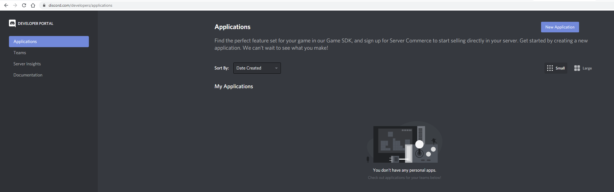
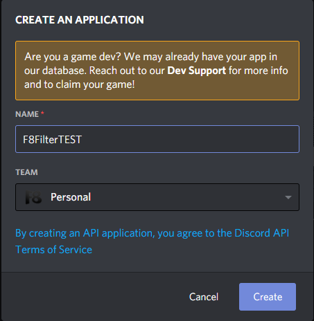
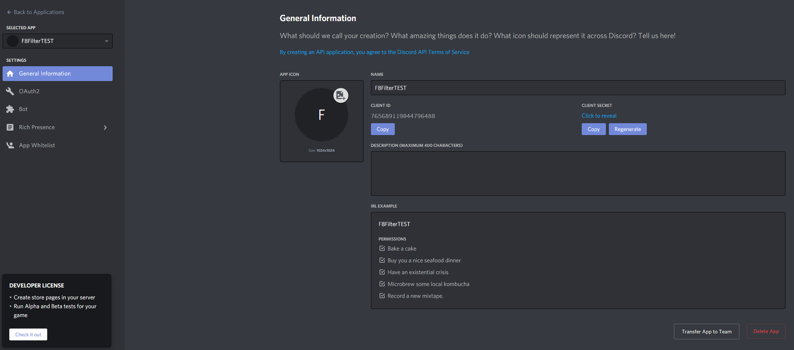
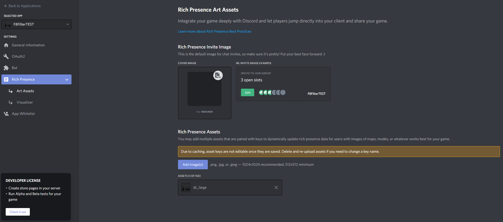
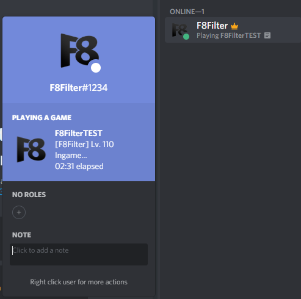

# Discord Overlay Entegrasyon Rehberi

Discord Overlay entegrasyonu, oyuncularınız discord uygulaması üzerinde çevrimiçi iken ve "Game Activity" bölümü açık durumdayken istemciniz(client) çalışır durumdayken sizin oyununuzu oynadığını gösterir.

**Discord Entegrasyonunu yaparken "Game Overlay" kısımında bazı zorunlu bilgileri doldurmanız gerekmekte, bunlar sırası ile;**

>APP ID: Uygulamanızın ClientID'si
>
>Large Image Name: Uygulamanızın gösterilecek resimi.
>
>Display Name: Uygulamanızın gösterilecek adı.

**Öncelikle discord hesabımız ile [discord developer portalına](https://discord.com/developers/applications) giriş yapıyoruz.**

**Ardından New Application'a tıklayarak bir Application oluşturuyoruz.**

**Name alanına oyun uygulama adını yazıyoruz ve Create butonuna basarak uygulamamızı oluşturuyoruz.**

**Uygulamamızı başarı ile oluşturduk. Şimdi bu alandaki Client ID'yi alıp Filter sitesindeki APP ID bölümüne yazıyoruz.**

**Şimdi "Rich Presence" alanındaki "Art Assets" bölümüne gelip discord iconumuzu oluşturalım. "örneğin biz dc_large.png adında oluşturduk." Add image(s) butonuna tıklayıp oluşturduğumuz iconu ekliyoruz. Daha sonrasında ise Filter sitesindeki Large Image Name alanına eklemiş olduğunuz icon'un adını yazıyorsunuz.**

**Hepsi bu kadar. Son olarak Filter sitesindeki Display Name bölümüne Oyununuzun adını girmeyi unutmayın.**
