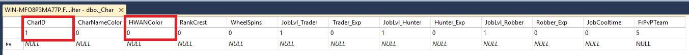
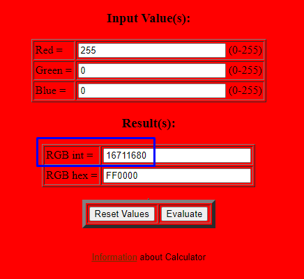

# Hwan(Title) Color Rehberi

HwanColor(Title) renklendirme sistemi ile kullanıcılarınızın title'larını renklendirebilirsiniz. Kullanımı oldukça basittir. F8Filter veritabanından _Char tablosundaki HwanColor kolonunu güncellemeniz yeterlidir.

**NOT:Charnamecolor renklerini RGB den int'e çevirmeniz gerekir.Örnek siteye [bu adresten](https://www.shodor.org/stella2java/rgbint.html) ulaşabilirsiniz.**

### Örnek kullanım;
Yukarıda verilen adresteki siteye girip dilediğiniz RGB kodundan rengimizi seçiyoruz, daha sonrasında seçtiğimiz renkten çıkan kodu aşağıdaki querydeki gibi çalıştırıyoruz.

~~~~Mssql
[USE F8Filter]
update _Char set CharNameColor = '16711680' where CharID = (select CharID from SRO_VT_SHARD.._Char(NOLOCK) where charname16 = 'F8FilterTEST') --Eğer shard veritabanı adınız SRO_VT_SHARD değilse query'i kendi shard veritabanı adınız ile çalıştırmalısınız.
~~~~